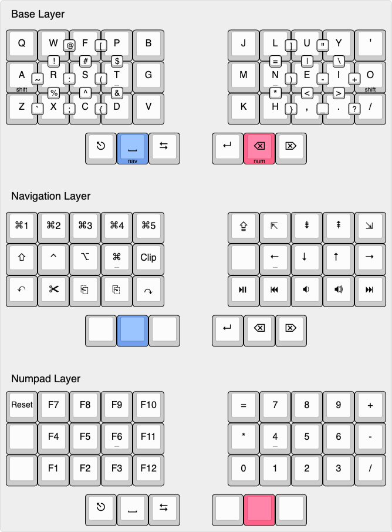

<<<<<<< HEAD
# Zephyr™ Mechanical Keyboard (ZMK) Firmware

[ZMK Firmware](https://zmk.dev/) is an open source ([MIT](LICENSE)) keyboard firmware built on the [Zephyr™ Project](https://www.zephyrproject.org/) Real Time Operating System (RTOS). ZMK's goal is to provide a modern, wireless, and powerful firmware free of licensing issues.

Check out the website to learn more: https://zmk.dev/.

You can also come join our [ZMK Discord Server](https://zmk.dev/community/discord/invite).

To review features, check out the [feature overview](https://zmk.dev/docs/). ZMK is under active development, and new features are listed with the [enhancement label](https://github.com/zmkfirmware/zmk/issues?q=is%3Aissue+is%3Aopen+label%3Aenhancement) in GitHub. Please feel free to add 👍 to the issue description of any requests to upvote the feature.
=======
# 36-key Combo Layout
A heavily modified keymap for the Alpaca Keyboard's Hotdox, implemented in QMK.

[Link to keyboard-layout-editor](http://www.keyboard-layout-editor.com/#/gists/39d751b9dc2e97a37b8e29fe4aa87cc5)

## Features
The keymap has the following features: 
* 36 keys
* Colemak DHm
* Home-row mods
* Combos for symbols
* Only two additional layers!

Layers can be toggled on/off with 3 taps of the corresponding thumb-key.

## Inspiration
Ideas for this keymap were drawn from the below resources:
* [Colemak Mod-DH](https://colemakmods.github.io/mod-dh/)
* [The Miryoku layout](https://github.com/manna-harbour/qmk_firmware/tree/miryoku/users/manna-harbour_miryoku)
* [Skychil's Kombol layout](https://github.com/skychil/kombol)
* [Jonas Hietala's T-34 layout](https://www.jonashietala.se/blog/2021/06/03/the-t-34-keyboard-layout/)
* [Precondition's home row mods writeup](https://precondition.github.io/home-row-mods)
* [gBoard's combo library](http://combos.gboards.ca/docs/install/)
>>>>>>> 5d42bcb1 (Added combos for symbols)
